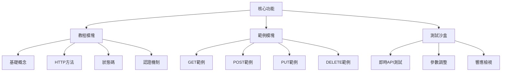
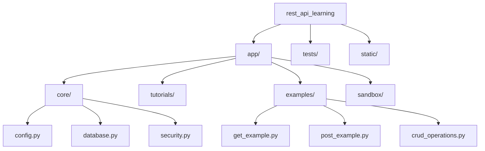

# REST API 學習網站技術架構

## 1. 框架選擇
**推薦框架：FastAPI**  
**版本：0.95.0**

### 框架比較表
| 框架         | 優點                          | 缺點                     | 適用場景               |
|--------------|-------------------------------|--------------------------|------------------------|
| Flask        | 輕量級、靈活性高              | 需手動整合擴展功能       | 小型項目/快速原型      |
| **FastAPI**  | 高性能、自動文檔生成          | 生態系統較新             | 中大型/高性能需求      |
| Django REST  | 全功能、內建管理後台          | 較重、學習曲線陡峭       | 企業級應用             |

## 2. 核心功能模塊


## 3. 目錄結構


## 4. 依賴套件 (requirements.txt)
```python
fastapi==0.95.0
uvicorn[standard]==0.21.1
sqlalchemy==1.4.46
pydantic==1.10.7
python-dotenv==0.21.0
```

## 5. 基礎API端點設計
### 資源模型 (app/models/item.py)
```python
from pydantic import BaseModel

class Item(BaseModel):
    id: int
    name: str
    description: str | None = None
```

### CRUD操作範例 (app/examples/crud_operations.py)
```python
from fastapi import APIRouter, HTTPException
from app.models.item import Item

router = APIRouter()
items_db = []

@router.get("/items")
async def get_items(): ...

@router.post("/items")
async def create_item(item: Item): ...

@router.put("/items/{item_id}")
async def update_item(item_id: int, item: Item): ...

@router.delete("/items/{item_id}")
async def delete_item(item_id: int): ...